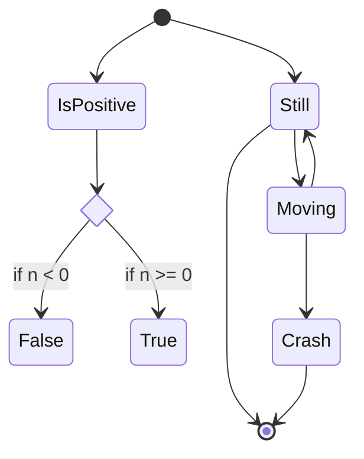
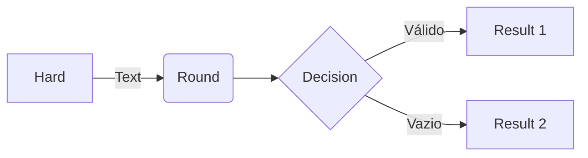

## $$\boxed{\color{red}Desafio Amigo Secreto}$$ 

## $$\textcolor{green}{orange background}$$

## 🔖 Sobre

Um projeto simples de Amigo Secreto utilizando HTML, CSS e JavaScript, Projeto utilizado nos cursos de lógica de programação da Alura

## Índice

- [Descrição](/#descrição)
- [An Internal Link to a Section Heading](/guides/content/editing-an-existing-page#modifying-front-matter)
- [Tecnologias Utilizadas](#tecnologias-utilizadas)
- [Instalação](#instalação)
- [Uso](#uso)
- [Contribuição](#contribuição)
- [Licença](#licença)

# Descrição

O projeto Amigo Secreto permite a organização de um sorteio de amigo secreto de maneira fácil e rápida. Com uma interface amigável, os usuários podem adicionar participantes e realizar o sorteio diretamente no navegador.

## 🚀 Tecnologias Utilizadas

<div>
  
  
  
</div>

[](https://github.com/anuraghazra/github-readme-stats)


## Instalação

Para visualizar e utilizar o projeto localmente, siga os passos abaixo:

1. Clone o repositório:
    ```bash
    git clone https://github.com/usuario/amigo-secreto.git
    ```

2. Navegue até o diretório do projeto:
    ```bash
    cd amigo-secreto
    ```

3. Abra o arquivo `index.html` no seu navegador preferido.

## Uso

# $$\boxed{\sf\color{red}Screenshots}$$

Here is a simple flow chart:





```flow
st=>start: Login
op=>operation: Login operation
cond=>condition: Successful Yes or No?
e=>end: To admin

st->op->cond
cond(yes)->e
cond(no)->op
```
1. Adicione o nome do participante no campo de entrada.
2. Clique no botão "Adicionar" para incluir cada nome na lista.
3. Após adicionar todos os participantes, clique no botão "Sortear Amigo" para realizar o sorteio.
4. O resultado do sorteio será exibido na tela.

## Contribuição

Para contribuir com o projeto, siga as etapas abaixo:

1. Faça um fork do projeto.
2. Crie uma nova branch para sua feature (`git checkout -b feature/nome-da-feature`).
3. Commit suas alterações (`git commit -m 'Adiciona nova feature'`).
4. Faça um push para a branch (`git push origin feature/nome-da-feature`).
5. Abra um Pull Request.

## 📝 Licença

Este projeto está licenciado sob a Licença MIT - veja o arquivo [LICENSE](LICENSE) para mais detalhes.


# $$\boxed{\sf\color{lightblue}Screenshots}$$
$${\color{red}Welcome \space \color{lightblue}To \space \color{lightgreen}Github}$$ :

# list
- [x] indice
- [x] indice 


#


###FlowChart


